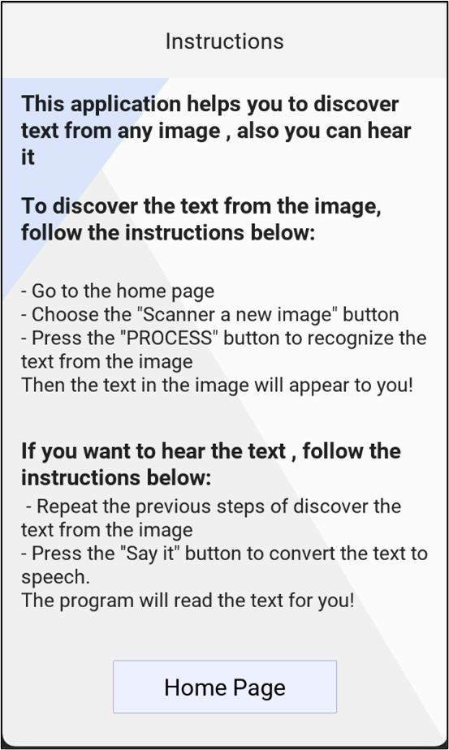

# 
# $${\color{lightblue}Recognize\space and\space Say\space it}$$
:large_blue_diamond: To fulfil the needs of the visually impaired and the normal people who have an identified reading disorder or struggle to read,
The application will convert the text in the taken picture to computer-synthesized voices, Recognize and Say provides a friendly interface that is easy to use.
### **:small_blue_diamond: The main stages were:**
- We had used OCR to scan the digitized text :memo: 	:mag:
- Then a deep Convolutional Neural Networks (DCNN) model that recognizes the text :woman_technologist:
- Lastly, we had used the text-to-speech liberary to read it out to the user. :sound: :loud_sound:

  
   
  
  
  
      

## :notebook: Prerequisite
- python-3.5+
- pytorch-0.4.1+
- torchvision-0.2.1
- opencv-3.4.0.14
- numpy-1.14.3

### :page_facing_up: Detection
- Detection is based on [CTPN](https://arxiv.org/abs/1609.03605), some codes are borrowed from 
[pytorch_ctpn](https://github.com/opconty/pytorch_ctpn)

### :mag: Recognition
- Recognition is based on [CRNN](http://arxiv.org/abs/1507.05717), some codes are borrowed from
[crnn.pytorch](https://github.com/meijieru/crnn.pytorch)

### :nut_and_bolt: Train
Training codes are placed into train_code directory.  
* Train [CTPN](./train_code/train_ctpn/readme.md)  
* Train [CRNN](./train_code/train_crnn/readme.md)
### :balance_scale: Licence
[MIT License](https://opensource.org/licenses/MIT)
